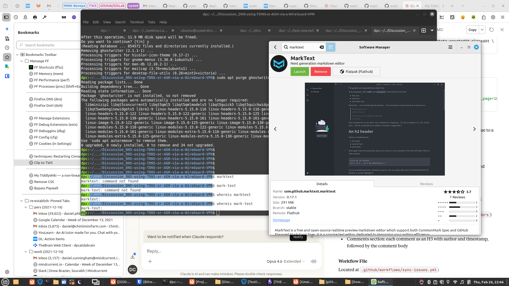
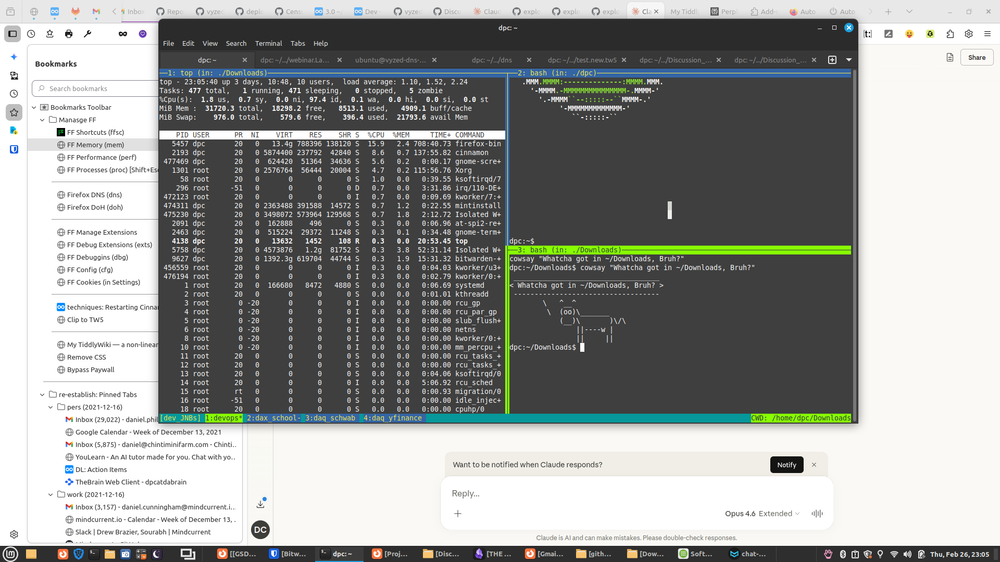
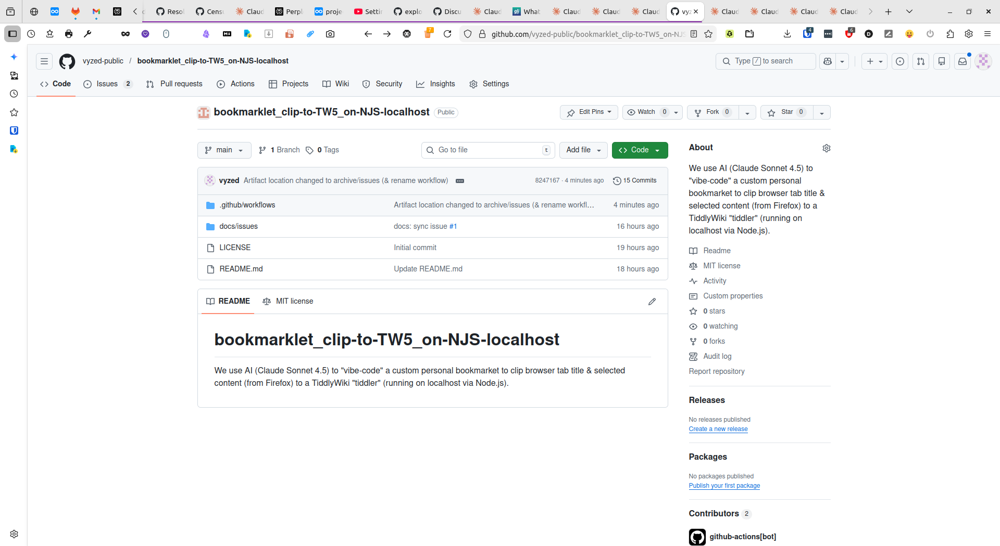

# Archive: In-Repo Issue Tracking via GitHub Actions

## User

Here's a question. Many times in my GitHub projects I track tasks by specific issues.
many times the tasks are not code based, but actually just procedural things that I need to track historically.

Is there a way of cloning those issues from GitHub into a local repo instance?

## Assistant

GitHub Issues aren't part of the Git repository itself — they live in GitHub's database, so `git clone` won't touch them. But there are a few ways to pull them down locally:

**GitHub CLI (`gh`) — easiest approach**

```bash
# Install if you don't have it
sudo apt install gh

# Authenticate
gh auth login

# List all issues (open and closed)
gh issue list --repo vyzed-public/explore_DNS-config-devops --state all --limit 500

# Dump a specific issue with comments
gh issue view 42 --repo vyzed-public/explore_DNS-config-devops --comments

# Export all issues as JSON
gh issue list --repo vyzed-public/explore_DNS-config-devops --state all --json number,title,body,comments,labels,state,createdAt,closedAt --limit 500 > issues.json
```

That JSON export is really flexible — you could script it to generate markdown files per issue, feed it into TiddlyWiki, etc.

**GitHub REST API — if you want more control**

```bash
curl -H "Authorization: token YOUR_PAT" \
  "https://api.github.com/repos/vyzed-public/explore_DNS-config-devops/issues?state=all&per_page=100" \
  > issues.json
```

Note this paginates at 100, so you'd need to loop through pages for larger projects.

**Storing issues inside the repo itself**

If your goal is to have issue tracking *as part of* the repo so it clones with the code, you might look into approaches like keeping a `docs/issues/` directory with markdown files, or tools like `git-bug` which stores issues directly in git refs.

Given that you're using these for procedural/non-code tracking and you're already exploring TiddlyWiki, exporting via `gh` to JSON and importing into TiddlyWiki could be a nice workflow — you'd get your historical record in a tool you're already building out.

## User

You hit the nail on the head.

My goal is ABSOLUTELY to have issue tracking as part of the repo so it clones with the code.
Since GitHub (and GitLab) issues are usually generated (and viewed) in markdown format, I'd like to save them in markdown format.

This would make them potentially quite tractable in both Obsidian and Tiddlywiki.

You've given me an interesting idea with the notion of using a `docs/issues` directory.

Is there a way of configuring GitHub so that action items entered into the web GUI for issues also get reflected into a `/docs/issues` directory (note that this should also include follow up comments that might be attached to any particular issue, since we use those to often track the CLI output of configuration commands for future reference.

## Assistant

There's no built-in GitHub feature for this, but a **GitHub Action** is the perfect fit. You can trigger it on issue and comment events, have it render the issue to markdown, and commit it back to the repo automatically.

Here's the general approach:

**`.github/workflows/sync-issues.yml`**

```yaml
name: Sync Issues to Docs

on:
  issues:
    types: [opened, edited, closed, reopened, labeled, unlabeled, deleted]
  issue_comment:
    types: [created, edited, deleted]

permissions:
  contents: write

jobs:
  sync:
    runs-on: ubuntu-latest
    steps:
      - uses: actions/checkout@v4

      - name: Sync issue to markdown
        env:
          GH_TOKEN: ${{ secrets.GITHUB_TOKEN }}
        run: |
          ISSUE_NUMBER=${{ github.event.issue.number }}

          # Fetch issue data as JSON
          gh issue view "$ISSUE_NUMBER" \
            --repo ${{ github.repository }} \
            --json number,title,body,state,labels,createdAt,closedAt,author,comments \
            > /tmp/issue.json

          mkdir -p docs/issues

          # Build the markdown file
          python3 << 'PYTHON'
          import json, os

          with open("/tmp/issue.json") as f:
              issue = json.load(f)

          n = issue["number"]
          md = []
          md.append(f"# #{n}: {issue['title']}")
          md.append("")
          md.append(f"**State:** {issue['state']}")
          md.append(f"**Author:** {issue['author']['login']}")
          md.append(f"**Created:** {issue['createdAt']}")
          if issue.get("closedAt"):
              md.append(f"**Closed:** {issue['closedAt']}")
          if issue.get("labels"):
              labels = ", ".join(l["name"] for l in issue["labels"])
              md.append(f"**Labels:** {labels}")
          md.append("")
          md.append("---")
          md.append("")
          md.append(issue.get("body") or "*No description provided.*")

          if issue.get("comments"):
              md.append("")
              md.append("---")
              md.append("")
              md.append("## Comments")
              for c in issue["comments"]:
                  md.append("")
                  md.append(f"### {c['author']['login']} — {c['createdAt']}")
                  md.append("")
                  md.append(c["body"])

          filename = f"docs/issues/issue-{n:04d}.md"
          with open(filename, "w") as f:
              f.write("\n".join(md) + "\n")
          PYTHON

      - name: Commit and push
        run: |
          cd $GITHUB_WORKSPACE
          git config user.name "github-actions[bot]"
          git config user.email "github-actions[bot]@users.noreply.github.com"
          git add docs/issues/
          git diff --cached --quiet && exit 0
          ISSUE_NUMBER=${{ github.event.issue.number }}
          git commit -m "docs: sync issue #${ISSUE_NUMBER}"
          git push
```

**What this gives you:**

Each issue becomes something like `docs/issues/issue-0042.md` containing the title, metadata, body, and all comments in chronological order. Every time someone opens, edits, or comments on an issue through the GitHub web UI, the action fires and updates the corresponding markdown file.

**A few things to be aware of:**

The action commits back to the repo, so you'll see bot commits in your history. If you'd prefer those isolated, you could have the action commit to a dedicated branch like `docs/issue-sync` and merge periodically. Also, if an issue gets deleted, you may want to handle that explicitly — the current `deleted` trigger fires but you'd need to add logic to remove the file rather than trying to fetch a now-missing issue.

For an initial backfill of existing issues, you could run a one-time script locally:

```bash
for i in $(gh issue list --repo vyzed-public/explore_DNS-config-devops --state all --json number --jq '.[].number'); do
  gh issue view "$i" --repo vyzed-public/explore_DNS-config-devops \
    --json number,title,body,state,labels,createdAt,closedAt,author,comments \
    | python3 -c "
import json, sys, os
issue = json.load(sys.stdin)
n = issue['number']
# ... same markdown generation logic ...
"
done
```

This pairs nicely with your TiddlyWiki setup — you could even extend the markdown frontmatter with YAML metadata that TiddlyWiki or Obsidian can parse for filtering and linking.

## User

Please generate a discussion summary document:
`summary.issue-tracking_IN-repo_via-dir_docs_issues.md`

...starting from my prompt that begins with:
"Here's a question. Many times in my GitHub projects I track tasks by specific issues."

## Assistant

[Generated the summary document `summary.issue-tracking_IN-repo_via-dir_docs_issues.md`]

## User

I'm surprised that browsers like Firefox and Brave/Chrome don't let you edit markdown files. I'm even more surprised they don't really even let you view them.

Is there a web browser extension that lets you view and edit markdown files?
As long as it looks decent enough to look like Tiddler Wiki Markdown or Obsidian Markdown -- Or even GitHub or GitLab markdown is good enough.

Here's the application I'm thinking of.
I have Claude Exporter already installed.
I also have Mark Download installed.
So if I were to save this current chat,
which has now taken a very interesting turn towards generalized GitHub management.
But I wanted to get rid of the now irrelevant stuff about authentication in GitHub.
I would want a quick way to edit the markdown and get rid of the stuff that wasn't really relevant.

## User

So... GhostWriter sucked.  Spiked my CPU, etc. But....

It looks like Mark Text is actually available by the system software manager installer.

## Assistant

Nice, even easier. Go ahead and install it through there — saves you the AppImage setup. Give it a test run and see if it behaves itself on the CPU front.

## User

WTF? It's in the menu, and clickable, but nothing happens?

## Assistant

Try launching it from the terminal so you can see any error output:

```bash
marktext
```

If that doesn't work, try:

```bash
mark-text
```

Whatever errors it spits out will tell us what's going on — could be a missing dependency, a sandboxing issue with the Flatpak/Snap version, or something else entirely.

## User



This screenshot shows the status post install with the software manager and also shows nothing happening on the command line.

## Assistant

It's a Flatpak — that's why the terminal can't find it. Flatpak apps don't land on your PATH like apt packages do. Try:

```bash
flatpak run com.github.marktext.marktext
```

That should launch it and also show any errors if it's crashing silently. The package name `com.github.marktext.marktext` is visible in your Software Manager details.

## User

OK, back to the weird install issues:

```
dpc:~/.../Discussion_DNS-using-TDNS-or-AGH-via-a-WireGuard-VPN$ flatpak run com.github.marktext.marktext
error: runtime/org.freedesktop.Platform/x86_64/23.08 not installed
```

## Assistant

Missing runtime. Install it:

```bash
flatpak install flathub org.freedesktop.Platform//23.08
```

Then try launching again:

```bash
flatpak run com.github.marktext.marktext
```

## User

Why didn't the system software manager installation process take care of this?

## Assistant

It should have. Flatpak is supposed to pull in required runtimes as dependencies automatically during install. A few things that can cause this:

The most common culprit is that the Flathub remote wasn't fully configured or the Software Manager did a partial install. Sometimes the Mint Software Manager handles Flatpaks a bit differently than running `flatpak install` directly from the command line, and dependency resolution doesn't always work perfectly through the GUI layer.

It's a known rough edge with Flatpak on Linux Mint — not a "you did something wrong" situation, just the packaging system not being as polished as apt where dependencies are basically bulletproof.

## User

How sure are you about this? I don't want to screw up my system.

## Assistant

Very sure. The Freedesktop Platform runtime is the base runtime that most Flatpak apps depend on — it's essentially the equivalent of a shared library package. It's sandboxed, it doesn't touch your system libraries or apt packages, and it's one of the most commonly installed Flatpak components out there.

The worst case scenario is it downloads ~600MB and Mark Text still doesn't work for some other reason. It won't break anything.

## User

Do I need to sudo the flat pack install?

## Assistant

No. Flatpak manages its own permissions — `flatpak install` will prompt you to confirm, but it doesn't need `sudo`. If it was installed system-wide through the Software Manager, it might ask for your password during the process, but you don't prefix it with `sudo`.

## User

What the fuck even is Flattop and why is it out there as opposed to the normal sudo app install stuff or the normal debian package management?

## Assistant

Ha — Flatpak (autocorrect got you there).

The short version: traditional `.deb` packages are tightly coupled to your specific distro and version. A package built for Ubuntu 24.04 might not work on Mint 22, or Debian 12, or Fedora. Every distro maintains its own repositories, and developers who want to distribute an app have to build and test it for each one. It's a lot of overhead, and apps in distro repos often lag behind the latest releases.

Flatpak tries to solve this by bundling the app with everything it needs to run inside a sandbox. The app brings its own libraries and depends on a shared runtime (like that Freedesktop Platform you just installed) rather than your system's packages. One build works across all Linux distros. Flathub is the central repository where developers publish these.

**The tradeoffs:**

The upside is developers ship one package that works everywhere, users get newer versions faster, and the sandboxing adds a security layer.

The downside is exactly what you just experienced — it's a parallel ecosystem sitting on top of your system. You now have *three* package systems to deal with (apt, Snap, and Flatpak), apps are bigger because they bundle their own dependencies instead of sharing system libraries, and the tooling is clunkier. Things that "just work" with apt sometimes have weird rough edges in Flatpak.

Honestly, for someone like you who's comfortable with apt and the command line, Flatpak mostly adds complexity without a ton of benefit. It's more useful for app developers and for distros that want to offer a wider app catalog without maintaining all the packages themselves. Mint started leaning into Flatpak after they blocked Snap (which is Canonical/Ubuntu's competing version of the same idea, but worse because it's centrally controlled).

## User

Well I'll be damned, it works now.

## Assistant

Nice. How's the CPU looking — is it behaving itself unlike Ghostwriter?

## User



I think we're doing better?

## Assistant

Way better. Load average down to 1.10, 8.5GB of RAM free (was almost zero before), and swap dropped from 946MB to 396MB. Mark Text isn't even showing up in `top`, which is exactly what you want from a text editor.

Also, love the cowsay.

## User

Please generate a discussion summary document:
`summary.markdown-viewer-editors-apps.md`
...starting from my prompt that begins with:
"I'm surprised that browsers like Firefox and Brave/Chrome don't let you edit markdown files."

Be sure to include the details from my initial inquiry:
"I'm surprised that browsers like Firefox and Brave/Chrome don't let you edit markdown files. I'm even more surprised they don't really even let you view them.
Is there a web browser extension that lets you view and edit markdown files? As long as it looks decent enough to look like Tiddler Wiki Markdown or Obsidian Markdown -- Or even GitHub or GitLab markdown is good enough."

As well as the follow-up use case:
"Here's the application I'm thinking of. I have Claude Exporter already installed. I also have Mark Download installed. So if I were to save this current chat, which has now taken a very interesting turn towards generalized GitHub management, but I wanted to get rid of the now irrelevant stuff about authentication in GitHub. I would want a quick way to edit the markdown and get rid of the stuff that wasn't really relevant."

## Assistant

[Generated the summary document `summary.markdown-viewer-editors-apps.md`]

## User

In the markdown document: `Summary.issue tracking in repo via dir docs issues · MD`;
In section: "Chosen Solution: GitHub Action for Automated Sync";
You present content for "Workflow File";
And you say: Located at `.github/workflows/sync-issues.yml`:

If I'm using the web GUI for GitHub, do I just create a new file: `sync-issues.yml` right in the relative root dir of the project, or does it go in an implicit (and hidden) `.github` dir?

In other words, where do I plunk that file down, and say: "here's you new home!"?

## Assistant

It goes in the `.github/workflows/` directory — that's a real directory in your repo, not something GitHub creates behind the scenes. The dot prefix makes it hidden on Linux (`ls` won't show it without `-a`), but it's a normal directory you create and commit.

From the GitHub web GUI, the easiest way is:

1. Navigate to your repo
2. Click **Add file → Create new file**
3. In the filename field, type: `.github/workflows/sync-issues.yml`

GitHub's web editor will automatically create the nested directories as you type the slashes. Paste in the workflow content, commit, and you're done. GitHub Actions picks it up automatically from that specific path — there's no separate "enable" step.

The directory structure looks like:

```
your-repo/
├── .github/
│   └── workflows/
│       └── sync-issues.yml
├── docs/
│   └── issues/
└── everything-else/
```

If you're doing it from the CLI instead:

```bash
mkdir -p .github/workflows
# place the file
git add .github/workflows/sync-issues.yml
git commit -m "ci: add issue sync workflow"
git push
```

## User

I'd like to propose an improvement...

But I don't want to borrow trouble...

Can the workflow in: `.github/workflows/sync-issues.yml` be extended to have a file naming schema that places the issue title (as defined OR modified by the user) after the auto-generated prefix: `issue-NNNN`?

For simplicity's sake, we would turn any space into an underbar. And filter out any troublesome characters for file paths/names (such as `/`, `:`, etc.)

So if I had 15 existing issues, and I were to make a new issue number 16 that is named: "Troubleshoot: DNS over VPN tunnel", we would generate the markdown file name to be:
`issue-0016.Troubleshoot_DNS_over_VPN_tunnel.md`

And then I came along in 5 minutes and changed the name to be: "Troubleshoot: DNS on spoke within VPN ", we would generate the markdown file name to be:
`issue-0016.Troubleshoot_DNS_on_spoke_within_VPN.md`

How straightforward is this and what risks does it introduce?

Don't proceed to do it yet until we agree.

## Assistant

Pretty straightforward to implement — it's just a string sanitization step in the Python script. The filename generation would strip colons, slashes, quotes, and other problematic characters, replace spaces with underscores, and truncate at a reasonable length to avoid filesystem limits.

**The one real risk is the rename scenario.** When someone edits an issue title, the action generates a new filename — but the old file with the old title is still sitting there. So your `docs/issues/` directory would end up with:

```
issue-0016.Troubleshoot_DNS_over_VPN_tunnel.md      ← stale
issue-0016.Troubleshoot_DNS_on_spoke_within_VPN.md   ← current
```

The fix is straightforward: before writing the new file, the script globs for `issue-0016.*` and deletes any existing match before writing the new one. That way a rename is always clean.

**Other minor considerations:**

- **Filename length:** Some titles could get long. We'd want a max character cap (say 100 characters for the title portion) with clean truncation at a word boundary.
- **Duplicate sanitized titles:** Two issues could theoretically produce the same sanitized title, but since the `issue-NNNN` prefix is unique, this doesn't actually matter.
- **Character edge cases:** Titles with emoji, non-ASCII characters, or strings of special characters. We'd want to decide whether to strip those entirely or transliterate them.

None of these are showstoppers. The glob-and-delete for renames is the only part that requires a bit of care to get right. Want me to go ahead and build it?

## User

Let's work our way backwards on these questions before we come to a decision on starting...

For character edge cases, (emojis, etc.) let's just strip those out. Let's stick to ASCII and eliminate all those edge cases.

Duplication of sanitized titles is not an issue because we have the issue number prefix. If a human being ends up looking at them, he'll go, Why the fuck did they name these the same thing? But he'll understand that those are two separate issues, simply due to their different issue numbers, so they would have a heads up that something unusual must be going on in order for those names to collide (likely something like two or more closely related issues with differences in timing or scope, etc.).

Let's set the file name length to a hundred characters max and if we hit a hundred characters, tack on three periods to symbolize ellipses. So our real max is a hundred and three characters.

For the renaming issue we would indeed want to delete the stale entry. You say that's a tricky issue? How worried are you about it?

Again, don't start yet. We need to make sure we're synchronized.

## Assistant

Not tricky at all, actually — "requires a bit of care" was probably overcautious on my part. The logic is simple:

```python
import glob

# Before writing the new file, delete any existing file for this issue number
for old_file in glob.glob(f"docs/issues/issue-{n:04d}.*"):
    os.remove(old_file)
```

Since the issue number prefix is always `issue-NNNN.`, the glob pattern is unambiguous — it can't accidentally match a different issue. The only way it could go wrong is if the git commit step fails *after* the delete but *before* the new file is written, which would mean a brief moment where the issue file is missing from the repo. But even that self-heals on the next issue event, and it's an extremely unlikely race condition.

So to recap where we've landed:

- **Character handling:** ASCII only, strip everything else (emoji, non-ASCII, special path characters like `/ : \ " ' ?`)
- **Spaces:** Replace with underscores
- **Duplicate titles:** Non-issue due to unique `issue-NNNN` prefix
- **Filename length:** 100 character max on the title portion, plus `...` if truncated (103 effective max for the title part)
- **Renames:** Glob `issue-NNNN.*` and delete before writing the new file
- **Risk level:** Low

Does that match your understanding? If so, I'll build the updated workflow.

## User

Can the file we created: `sync-issues.yml` be arbitrarily named?
How is it configured to be triggered, and what fires it off?
Could it be called `sync-issues.v01a.yml`, and still be fired upon updates?

## Assistant

Yes, the filename is arbitrary. GitHub Actions will pick up and run any `.yml` or `.yaml` file inside `.github/workflows/` — it doesn't care what you call it. So `sync-issues.v01a.yml` works fine.

What triggers it isn't the filename — it's the `on:` block inside the file:

```yaml
on:
  issues:
    types: [opened, edited, closed, reopened, labeled, unlabeled, deleted]
  issue_comment:
    types: [created, edited, deleted]
```

GitHub watches for those events at the platform level. When someone opens, edits, or comments on an issue through the web GUI (or API), GitHub looks in `.github/workflows/` for *any* workflow file whose `on:` block matches that event, and runs it.

So you could have:

```
.github/workflows/
├── sync-issues.v01a.yml        ← triggered by issue events
├── build-and-test.yml           ← triggered by push/PR events
└── weekly-cleanup.yml           ← triggered by a cron schedule
```

They all coexist independently, each firing on their own triggers. The versioned naming is a good habit — makes it obvious when you're iterating on a workflow.

## User

So, if we had two files: `sync-issues.v01a.yml` and `sync-issues.v02a.yml` they would BOTH get called? And then the only way to disable `sync-issues.v01a.yml` would be to rename it something like: `sync-issues.v01a.yml.disabled`?

## Assistant

Exactly right on both counts. If both files have the same `on:` triggers, GitHub runs both of them independently — it doesn't know or care that they're related. You'd get duplicate commits, or worse, race conditions where both try to write and push to the same files simultaneously.

And yes, renaming to `.yml.disabled` (or anything that doesn't end in `.yml` or `.yaml`) is the quick-and-dirty way to deactivate one. The other common approaches are:

- Delete the old file entirely (cleanest, use git history if you need it back)
- Move it out of `.github/workflows/` into something like `.github/workflows-archive/`
- Add `if: false` to the job so it still triggers but immediately skips:

```yaml
jobs:
  sync:
    if: false
    runs-on: ubuntu-latest
```

For your versioning use case, the simplest discipline is probably: when you promote `v02a`, delete `v01a` in the same commit. That way there's never two live versions, and git history preserves the old one if you ever need to look back.

## User

Gotcha. Just to make sure we're thinking the same thing, Is it true that our newly commited `sync-issues.yml` file is itself is under proper version control?

So if for some reason we wanted to go back to the original version, we could just get that "OG" version back with a `git` command?

## Assistant

Exactly. It's just a file in the repo like any other — every change you commit is in the git history. If you update `sync-issues.yml` and want to roll back:

```bash
# See the commit history for that specific file
git log --oneline .github/workflows/sync-issues.yml

# Restore a previous version
git checkout <commit-hash> -- .github/workflows/sync-issues.yml
git commit -m "revert sync-issues.yml to original version"
```

So there's no need for the `v01a`/`v02a` naming convention purely for version safety — git already gives you that. The versioned naming is still useful if you want to *visually* signal to yourself that a major rewrite happened, but it's a style choice, not a necessity.

## User

I think we're good to go.
Go ahead and generate the new workflow file.
Update the summary markdown file to note:

We prototyped an initial "basic" (non title generating) version;
which can be retrieved by the `git` operations you just enumerated.

Now we have new workflow file content that implements our updated spec.
Update the new "Workflow File" content section with the updated workflow.

## Assistant

[Generated updated `sync-issues.yml` with sanitized title filenames and updated `summary.issue-tracking_IN-repo_via-dir_docs_issues.md` with version history section, filename sanitization rules, and the new workflow content.]

## User

In the summary doc, you mention:
"Deleted issues: The `deleted` trigger fires, but needs explicit logic to remove the corresponding markdown file rather than attempting to fetch a now-missing issue."

Is that still a risk? Or did you add the "explicit logic to remove the corresponding markdown file"?

## Assistant

Still a risk. The delete case isn't handled. Here's what happens: when an issue is deleted, the `deleted` trigger fires, but the first thing the workflow does is `gh issue view` on that now-deleted issue — which will fail. The glob-and-delete logic I added only runs inside the Python script, which never executes because the `gh` command errors out before it gets there.

The fix would be to add an early step that detects a delete event and just removes the file directly without trying to fetch the issue:

```yaml
      - name: Handle deleted issue
        if: github.event.action == 'deleted'
        run: |
          ISSUE_NUMBER=${{ github.event.issue.number }}
          cd $GITHUB_WORKSPACE
          mkdir -p docs/issues
          rm -f docs/issues/issue-$(printf '%04d' $ISSUE_NUMBER).*
          git config user.name "github-actions[bot]"
          git config user.email "github-actions[bot]@users.noreply.github.com"
          git add docs/issues/
          git diff --cached --quiet && exit 0
          git commit -m "docs: remove deleted issue #${ISSUE_NUMBER}"
          git push

      - name: Sync issue to markdown
        if: github.event.action != 'deleted'
        # ... rest of existing step ...
```

The `printf '%04d'` ensures the glob matches the zero-padded format, and `rm -f` won't error if the file is already gone.

Want me to fold this into the workflow and update the summary?

## User

Am I correct in thinking this is a non-issue for the backfill script?

## Assistant

Correct. The backfill script gets its list of issue numbers from `gh issue list`, which only returns issues that currently exist. A deleted issue won't appear in that list, so the script will never try to fetch one.

The delete problem is exclusively a GitHub Action concern — it's an event-driven reaction to something that just happened, as opposed to the backfill which is a snapshot of current state.

## User

Yes, update the workflow, and summary.

## Assistant

[Updated `sync-issues.yml` with a "Handle deleted issue" step, gated the sync and commit steps with `if` conditions, and updated the operational considerations in the summary to reflect the delete case is now handled.]

## User

Code review time...
Where in `sync-issues.yml` (as in line number) is the logic for the issue deletion protection?

## Assistant

Three pieces working together:

- **Lines 18–30:** The "Handle deleted issue" step — runs *only* on issue delete events, removes the file via glob, commits, and pushes.
- **Line 33:** The `if` guard on "Sync issue to markdown" — skips the `gh issue view` fetch when it's a delete, preventing the failure.
- **Line 114:** The `if` guard on "Commit and push" — skips the normal commit step on delete since line 30 already handled that.

## User

OK, change in specs here -- given that this has been so successful & useful, how difficult is it to change the directory scheme from: `docs/issues/` to `archive/issues/`?

The semantics of the directory naming here are that this isn't really documentation oriented at an end-user/consumer of our output/product, but rather a way of, well... archiving our development process that also happens to let us escape the (what looks to be deliberately designed) captive lock-in of the issue tracking mechanisms used by both GitHub and and GitLab. I say this, because there IS a way of making a localhost clone of the wiki associated with a project, so it seems that it should be straight-forward to also clone the issues to localhost as well.

So in this `archive/` dir, we might also want to create sub-dirs like `ai.chats/opus4.6` or `blogposts/medium/` or `images/screenshots`.

And then, any "end user" docs would end up in (naturally) `docs/`.

So that's the "why". How difficult/risky is the "how"?

## Assistant

Zero risk. It's a string replacement — `docs/issues/` → `archive/issues/` — across three files:

- `sync-issues.yml` (the workflow)
- `archive.repo-issues.into.docs-issues.bash` (the backfill script)
- `summary.issue-tracking_IN-repo_via-dir_docs_issues.md` (the summary doc)

The only consideration is if you've already committed the workflow with `docs/issues/` to a live repo and it's already generated files there. In that case you'd want to `git mv docs/issues/ archive/issues/` to preserve the history. But if you haven't deployed yet, it's a clean swap.

Want me to go ahead?

## User

If I'm using the web GUI (because I haven't cloned locally yet), how do I do that `git mv docs/issues/ archive/issues/` op?

## Assistant

You can't. The GitHub web GUI doesn't support moving or renaming directories. Your options are:

1. **Clone locally, do the move, push.** This is the clean way.

2. **Rename files one at a time through the web GUI.** You can edit a file and change its path in the filename field (e.g., change `docs/issues/issue-0001.md` to `archive/issues/issue-0001.md`). GitHub creates the new directory structure automatically. But doing this per-file is painful if you have more than a handful.

3. **Since you haven't deployed yet** — just commit the workflow with `archive/issues/` from the start. No move needed because nothing exists in `docs/issues/` yet.

Option 3 is your situation, right? If so, there's nothing to migrate — I just update the files and you deploy them fresh.

## User

I have in fact, deployed (that's why I can see it's already been so incredibly useful) but I've only done a handful of files, so I think I will just do option number 2.

You know, I haven't used their workspaces yet, but I imagine that ends up offering a CLI for you as well. I wonder if that's a fourth option for doing this?

## Assistant

You're thinking of **GitHub Codespaces** — and yes, that would work. It gives you a full VS Code environment in the browser with a terminal. You'd be able to run `git mv docs/issues/ archive/issues/` directly, commit, and push, all without cloning to your local machine.

There's also a lighter option: pressing `.` (period key) on any repo page opens **github.dev**, which is a browser-based VS Code editor. It doesn't have a terminal, but it does let you move/rename files through the file explorer sidebar, which would be faster than renaming them one at a time through the regular GitHub web UI.

For a handful of files though, option 2 is probably quickest. Once you've moved them, let me know and I'll update all three files with the `archive/issues/` path.

## User

The edit interface doesn't really offer a clean way to rename the path.
I think I'll try the github.dev option.

## Assistant

Nice. Just hit `.` on your repo page and it'll open up. In the file explorer sidebar you can right-click files and rename them — just change the full path from `docs/issues/whatever.md` to `archive/issues/whatever.md`. It should create the `archive/issues/` directory automatically as you type.

Once you've moved them all, commit through the Source Control panel on the left (the branch icon). Let me know when you're done and I'll update the three files.

## User

I'm not getting it. What does "Just hit `.` on your repo page" mean?

## Assistant

Literally press the period key (`.`) on your keyboard while you're viewing your repository on GitHub in the browser. It's a keyboard shortcut — GitHub will redirect from `github.com/your-repo` to `github.dev/your-repo` and open the web-based VS Code editor automatically.

## User

Yeah... that ain't workin'.

## Assistant

Just change the URL manually. In your browser address bar, replace `github.com` with `github.dev` in the URL and hit Enter. So:

`https://github.com/vyzed-public/explore_DNS-config-devops`

becomes:

`https://github.dev/vyzed-public/explore_DNS-config-devops`

## User

That's pretty cool. How do I exit that mode? Just replace the URL?

## Assistant

Yep, just change `github.dev` back to `github.com` in the URL. Or just navigate to github.com normally — there's no "mode" to exit, it's just a different site using the same repo.

## User

How useful is that web GUI? It is an actual full instance of VS Code?

## Assistant

It's VS Code in the browser, but limited. You get the editor, file explorer, search, and source control — so it's great for editing files, renaming, moving things around, and committing. Extensions are partially supported (ones that don't need a backend).

What you *don't* get is a terminal, build tools, or any runtime environment. So you can't run scripts, install packages, or test code. It's essentially a fancy text editor with git integration.

**Codespaces** is the full version — actual VM with a terminal, where you can run anything. But that's a paid feature (you get some free hours per month on the free tier, though).

For what you're doing right now — moving files between directories — github.dev is perfect. For anything that needs `bash`, you'd need Codespaces or a local clone.

## User

Okay, I'm back. Are you ready with your changes?

## Assistant

[Updated all three files — `sync-issues.yml`, `archive.repo-issues.into.docs-issues.bash`, and `summary.issue-tracking_IN-repo_via-dir_docs_issues.md` — replacing `docs/issues/` with `archive/issues/` throughout, including commit message prefixes changed from `docs:` to `archive:`.]

## User



Hey, the changes I made when I was using github.dev aren't showing up when I go back to github.com. What's going on?

## Assistant

Did you commit the changes in github.dev? It doesn't auto-save to the repo — you have to explicitly commit through the **Source Control** panel (the branch icon on the left sidebar). If you just moved/renamed files and closed the tab, those changes were lost.

I can see from the screenshot that the workflow was updated 4 minutes ago ("Artifact location changed to archive/issues"), but `docs/issues` is still there and there's no `archive/issues` directory. So it looks like the workflow file change went through but the file moves didn't get committed.

## User

Ah -- I see. OK, went back & did that. That's better.

## Assistant

Good. Now that the `archive/issues/` directory is in place and the updated workflow is deployed, the next issue event should trigger the action and write to the new location. You may want to test it by editing an existing issue's title or adding a comment to confirm it's writing to `archive/issues/` correctly.
